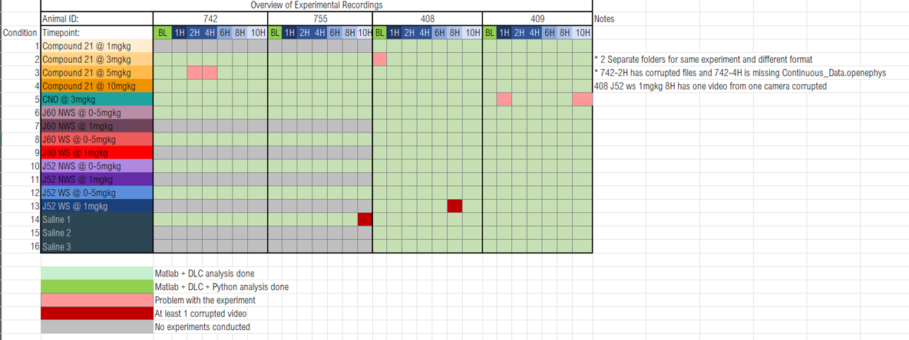
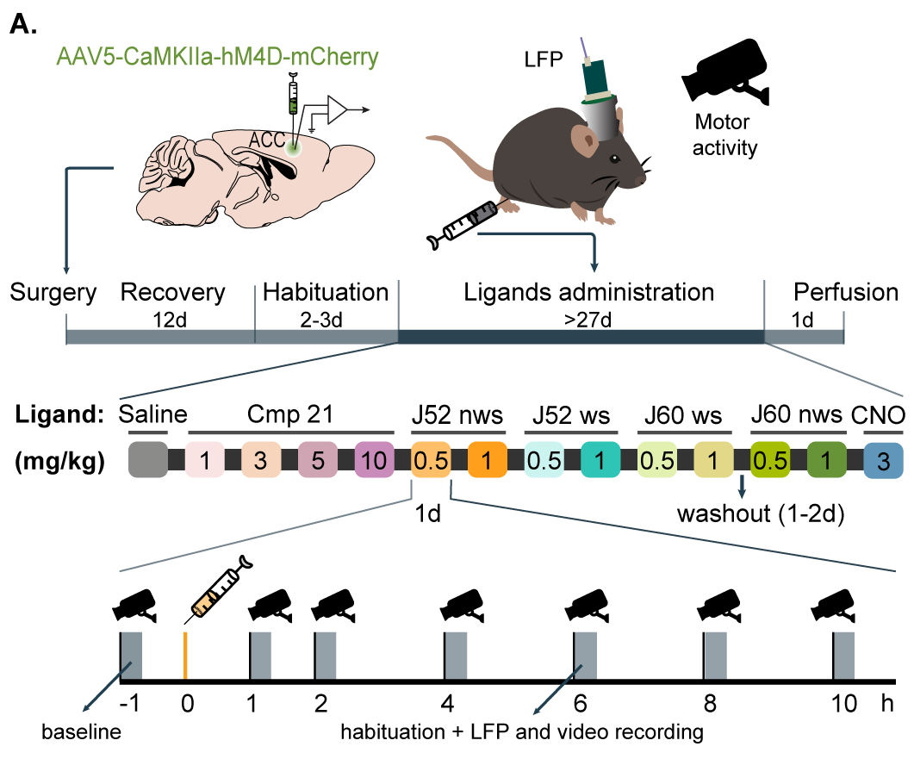

Note\* This version integrates the suggestions given by François-Xavier about
normalizing the data by individual global baseline.

# I. Introduction

This R Notebook is dedicated to the analysis of experimental data obtained from
a series of experiments designed to evaluate the effects of various DREADD
compounds administered by injections at different doses over time on the
activity levels of test subjects. The subjects' activity metrics were derived
from video recordings by processing the body center's instantaneous speed. These
metrics are analyzed to assess the potential impacts of the compounds, focusing
on key measurements.

**Subjects:** 4 subjects with ID's: 755, 742, 409 and 408.

-   **Treatments:**

    -   **Compounds and Doses:** A combination of 4 different compounds, each
        administered at different doses, resulting in unique compound-dose
        combinations.

-   **Control:** To ensure reliable analysis, two control conditions are
    incorporated:

    -   **Baseline activity:** Measurements of activity metrics before the
        injection of any compound, used to account for the subject's normal
        activity levels.
    -   **Saline injections:** A control condition where saline was injected
        instead of a compound, to determine whether observed effects are due to
        the compounds or just the injection process.

-   **Timing:**

    -   **Baseline Recording:** 1 hour before any injection (-1h).
    -   **Post-Injection Recordings:** 1 hour, 2 hours, 4 hours, 6 hours, and 10
        hours after each injection. Each unique compound-dose combination was
        administered once per subject, and each administration occurred on a
        different day.

-   **Data collection**

    -   **Activity Measurement:** Behavior was video recorded for 10 minutes
        after each injection.

-   **Metrics extracted:** The following metrics were calculated from the
    video-recordings:

    1.  **High activity (%)**: The percentage of time the subject's activity was
        classified as high, indicating periods of significant movement. It helps
        to evaluate the extent to which the compound increases or maintains high
        levels of activity.

    2.  **Low activity (%)**: The percentage of time the subject's activity was
        classified as low, reflecting periods of minimal movement. It is useful
        for understanding whether the compound induces lethargy or reduces
        overall activity.

    3.  **Occlusion (%)**: The percentage of time during which the subject could
        not be tracked due to occlusion, meaning the subject's body center was
        not visible or measurable. This metric is essential for assessing the
        quality and reliability of the tracking data.

    4.  **Mean (px/s)**: The mean speed of the subject's body center over the
        entire recording period. This provides a general sense of the subject's
        overall activity level and is a direct indicator of how the compound
        might influence average movement speed.

    5.  **Standard deviation (px/s)**: This measures the variability in the
        subject's speed, reflecting how consistent or varied their activity was
        during the recording period. High variability might indicate erratic
        behavior, while low variability could suggest consistent activity
        levels.

    6.  **Activity Distribution Ratios (ADR):**

        1.  **ADR Low/High+Occ**: The Activity Distribution Ratio (ADR) between
            low activity and the combined time of high activity and occlusion
            periods. This ratio helps to understand the relative dominance of
            low activity compared to periods of high activity or times when the
            subject was not trackable.

        2.  **ADR Low/High**: The Activity Distribution Ratio (ADR) between low
            and high activity periods. This metric is crucial for comparing the
            balance between periods of low and high activity, indicating how a
            compound may shift the subject's behavior towards more or less
            activity.

    7.  **Skewness:**

        1.  **Skewness low**: The skewness of the low activity distribution over
            time, indicating whether low activity periods are more concentrated
            at certain times during the experiment. A positive skew suggests
            that low activity occurs more frequently towards the end, while a
            negative skew indicates it is more common at the beginning.

        2.  **Skewness high**: The skewness of the high activity distribution
            over time, similar to the low activity skewness but focusing on
            periods of high activity. This metric helps to determine whether
            high activity is more likely at specific times during the
            experiment.

    8.  **Normalized entropy**: This metric represents the entropy of the
        activity distribution (AD) across the entire recording, normalized to a
        maximum entropy value. Entropy measures the randomness or
        unpredictability of the activity states (high, low, occlusion). A higher
        normalized entropy suggests a more even distribution of these states,
        while lower entropy indicates that one state is dominant."

**Experiments done**: The following table provides an overview of the data
available,including missing data (in red).



## II. Objectives

The primary objectives of this analysis are:

1.  **Quantify the Effects of Compounds and Doses:** Determine whether the
    different compounds and their doses significantly impact certain activity
    metrics, compared against the saline control.

2.  **Assess Dose-Response Relationships:** Explore how different doses
    influence the observed effects, and whether there is an interaction between
    compound type and dose.

3.  **Time-Dependent Changes:** Analyze how activity metrics evolve over time
    post-injection to identify any time-dependent effects of the compounds and
    how these compare to the saline injection.

4.  **Control for Baseline Activity:**

## III. Study design



# II. Data preparation

## 1. Load and check data structure

```{r setup, include=FALSE}

knitr::opts_chunk$set(echo = FALSE, cache = FALSE) # To remove code in HTML output

rm(list = ls()) # Clear environment

# Load libraries
library(ggpubr)  # For statistical tests and plotting
library(dplyr)   # For data manipulation
library(ggplot2) # For data visualization
library(lme4)    # For mixed-effects models
library(corrplot) # For correlation plots
library(ggbiplot) # For PCA plots
library(ggthemes) # Additional themes for ggplot
library(skimr)    # Summary statistics
library(psych)    # Descriptive statistics
library(glmmTMB)
library(tidyr)
library(car)

cat("\014") # Clear console

```

```{r echo=FALSE, message=FALSE, warning=TRUE, paged.print=TRUE}

file_path = "D:/OneDrive - ICM/Liz_NeuroMatlab/DLC_PoseAnalysis/Results/results.csv"

# Read the first line of the file
first_line <- readLines(file_path, n = 1)
# Check if it's comma-separated or tab-separated
sep <- if (grepl(",", first_line)) "," else ";"
# Read the file with the correct separator
data <- read.csv(file_path, sep = sep)

# View the first few rows to ensure the data has been loaded correctly
# head(data)

# Separate the relevant metadata (experiment descriptors) and the actual results
metadata <- data[, 1:4]   # Columns 1 to 4: ID, Compound, Dose, Post-injection time
results <- data[, 11:20]  # Columns 11 to 20: High activity percentage to entropy

# Convert the Compound column to a factor and Dose to numeric
metadata$Compound <- as.factor(metadata$Compound)
# Convert 'ID' to a factor
metadata$ID <- as.factor(metadata$ID)

# Convert 'Dose' to numeric by replacing commas with periods
metadata$Dose..mg.kg. <- gsub(",", ".", metadata$Dose..mg.kg.)  # Replace commas with periods
metadata$Dose..mg.kg. <- as.numeric(metadata$Dose..mg.kg.)  # Convert to numeric

# Ensure 'Saline' is included as part of 'Treatment'
metadata$Compound <- factor(metadata$Compound, levels = c("Saline", "21", "cno", "j60nws", "j60ws", "j52nws", "j52ws"))

# Convert 'Post Injection' column, where 0 represents Baseline
metadata$Post.injection <- as.numeric(metadata$Post.injection..h.)  # Assuming 0 = baseline

# Baseline activity: use the 'Post Injection' column to create a baseline indicator
metadata$Is_Baseline <- ifelse(metadata$Post.injection..h. == 0, 1, 0)  # 1 = Baseline, 0 = Post-injection

# Combine metadata with results for further analysis
data_combined <- cbind(metadata, results)

# Set custom levels for 'Treatment' to maintain the order of interest
custom_order <- c("Saline", "21", "cno", "j60nws", "j60ws", "j52nws", "j52ws")
data_combined$Compound <- factor(data_combined$Compound, levels = custom_order)


# Summary statistics of the results for exploration
#summary_results <- describe(results)
#summary_results

# Chunk cleaning
rm(data, metadata, results, custom_order, first_line, sep, file_path) 

```

## 2. Exploratory Data Analysis (EDA)

Assessing the distribution of activity metrics across different compounds,
doses, and time points.

#### 2.1 Box plots for all raw data (dependent variables)

```{r}
# Define custom color palette
color_palette <- c(
  "21_1" = "#fae3e3",   # Misty rose
  "21_3" = "#f7d4bc",   # Desert sand
  "21_5" = "#cfa5b4",   # Pink lavander
  "21_10" = "#c98bb9",  # African violet                        
  "j52nws_0.5" = "#ffbf69",  # Hunyadi yellow
  "j52nws_1" = "#ff9f1c",    # Orange peel
  "j52ws_0.5" = "#cbf3f0",   # Mint green
  "j52ws_1" = "#2ec4b6",     # Light sea green
  "j60nws_0.5" = "#e2f1af",  # Tea green
  "j60nws_1" = "#e3d888",    # Flax
  "j60ws_0.5" = "#a5be00",   # Apple green
  "j60ws_1" = "#679436",     # Asparagus
  "cno_3" = "#6096ba",       # Air blue
  "Saline_0" = "#8b8c89"     # Battleship gray
)
# Create a new column Compound_Dose in the data_combined for labels
data_combined <- data_combined %>%
  mutate(Compound_Dose = paste(Compound, Dose..mg.kg., sep = "_"))

# Ensure 'Compound_Dose' is treated as a factor with levels based on the custom color palette
data_combined$Compound_Dose <- factor(data_combined$Compound_Dose, levels = names(color_palette))

# Function to generate the plot with consistent y-axis limits
plot_metric <- function(metric_name, y_label) {
  
  # Calculate the global min and max for the metric across all groups for y-axis scaling
  y_min <- min(data_combined[[metric_name]], na.rm = TRUE) 
  y_max <- max(data_combined[[metric_name]], na.rm = TRUE)
  
   median_data <- data_combined %>%
    group_by(Post.injection..h., Compound_Dose) %>%
    summarize(median_value = median(.data[[metric_name]], na.rm = TRUE), .groups = 'drop')
  
  ggplot(data_combined, aes(x = as.factor(Post.injection..h.), y = .data[[metric_name]], fill = Compound_Dose)) +
    geom_boxplot(outlier.shape = NA, alpha = 0.6) +  # Suppress outliers to avoid double plotting
    geom_line(data = median_data, aes(x = as.factor(Post.injection..h.), y = median_value, group = Compound_Dose, color = Compound_Dose), size = 1) +  # Connect the median values
    geom_jitter(color = "#8b8c89", width = 0.2, alpha = 0.7, size = 1) +   # Add jittered individual points
    facet_wrap(~ Compound_Dose, scales = "fixed", ncol = 4) +
    labs(title = paste(y_label, "by Time Point and Compound+Dose"),
         x = "Post-Injection Time (hours)", y = y_label) +
    scale_fill_manual(values = color_palette) +
    scale_color_manual(values = color_palette) +  # Color points to match fill colors
    expand_limits(y = c(y_min, y_max)) +  # Apply the global min and max to all subplots
    theme_classic() +
    theme(
      axis.text.x = element_text(angle = 0, hjust = 1),
      strip.text = element_blank(),  # Remove facet labels
      panel.spacing = unit(0.5, "lines"),  # Control spacing between panels
      axis.line = element_line(color = "black"),  # Ensure axis lines are visible
      axis.ticks = element_line(color = "black"),  # Ensure ticks are visible
      panel.border = element_rect(fill = NA, color = "black")  # Add a border around each panel
    )
}

# Generate plots for all 10 metrics

p_adr_low_high <- plot_metric("ADR.Low.High", "ADR Low/High")
p_high_activity <- plot_metric("High.activity.percentage", "High Activity Percentage")
p_skewness_low <- plot_metric("skewness_low", "Skewness Low")
p_skewness_high <- plot_metric("skewness_high", "Skewness High")
p_entropy <- plot_metric("normalized.entropy", "Normalized Entropy")
# p_low_activity <- plot_metric("Low.activity.percentage", "Low Activity Percentage")
# p_mean_speed <- plot_metric("Mean", "Mean Speed (px/s)")
# p_sd_speed <- plot_metric("Std.deviation", "Speed Standard Deviation (px/s)")
# p_occlusion <- plot_metric("Occlusion.percentage", "Occlusion Percentage")
# p_adr_low_high_occ <- plot_metric("ADR.Low.High.Occ", "ADR Low/High+Occ")


# Display one of the plots (e.g., High Activity)
p_adr_low_high
p_high_activity
p_skewness_low
p_skewness_high
p_entropy
# p_low_activity
# p_mean_speed
# p_sd_speed
# p_occlusion
# p_adr_low_high_occ

# Chunk cleaning
rm(color_palette) 

```

```{r}
# Check for missing compound_dose combinations, these are the corrupted ones
# 
# Define known exceptions in a list (experiments not performed)
known_exceptions <- tribble(
  ~Compound_Dose, ~ID,
  "21_1", "742",
  "21_1", "755",
  "j60nws_1", "742",
  "j60nws_1", "755",
  "j60ws_1", "742", 
  "j60ws_1", "755",
  "j52nws_1", "742",
  "j52nws_1", "755", 
  "j52ws_1", "742",
  "j52ws_1", "755"
)

# Create a complete grid of all expected combinations
complete_data <- expand.grid(
  ID = unique(data_combined$ID),
  Compound_Dose = unique(data_combined$Compound_Dose),
  Post.injection = c(0, 1, 2, 4, 6, 8, 10)
)

# Remove known exceptions from complete_data
complete_data <- complete_data %>%
  anti_join(known_exceptions, by = c("ID", "Compound_Dose"))

# Find missing combinations
missing_data <- complete_data %>%
  anti_join(data_combined, by = c("ID", "Compound_Dose", "Post.injection")) %>%
  arrange(ID, Compound_Dose, Post.injection)

# Print missing combinations
if (nrow(missing_data) > 0) {
  print("Missing time points (excluding known exceptions):")
  print(missing_data)
} else {
  print("No missing time points found. All subjects have complete data for all Compound_Dose combinations.")
}

# Chunk cleaning
rm(known_exceptions, complete_data) 
```

## 3. Checking baseline homogeneity

```{r}
# 1 Check baseline homogeneity for each ID
baseline_homogeneity <- data_combined %>%
  filter(Is_Baseline == 1) %>%
  group_by(ID) %>%
  summarize(
    baseline_mean = round(mean(High.activity.percentage, na.rm = TRUE),2), # mean baseline
    baseline_sd = round(sd(High.activity.percentage, na.rm = TRUE),2), # Standard deviation
    baseline_cv = round((baseline_sd / baseline_mean) * 100,2),  # Coefficient of variation
    n_compound_doses = n_distinct(Compound_Dose)
  )

# Print results
print(baseline_homogeneity)

# 2 Visualize Baseline Data with Box Plots

# Metrics to analyze
metrics <- c("ADR.Low.High", "High.activity.percentage", "skewness_low", 
             "skewness_high", "normalized.entropy")

# Combine all metrics into a single dataframe with a new column to indicate the metric type
data_combined_long <- data_combined %>%
  filter(Is_Baseline == 1) %>%
  pivot_longer(cols = all_of(metrics), names_to = "Metric", values_to = "Value")

# Create the combined plot
p <- ggplot(data_combined_long, aes(x = factor(ID), y = Value, color = factor(ID))) +
  geom_boxplot(outlier.shape = NA, fill = "lightblue", alpha = 0.5) +
  geom_jitter(width = 0.2, alpha = 0.7) +
  facet_wrap(~ Metric, scales = "free_y", ncol = 3) +
  labs(title = "Baseline Distribution of Metrics by Animal ID",
       x = "Animal ID",
       y = "Metric Value") +
  theme_bw() +
  theme(axis.text.x = element_text(angle = 90, hjust = 1),
        legend.position = "none")  # Remove legend if it becomes too cluttered

# Print the plot
print(p)

# 3 Statistical Tests for Baseline Differences

# Subset baseline data
baseline_data <- data_combined %>% filter(Is_Baseline == 1)

for (metric in metrics) {
  print(paste("Statistical tests for metric:", metric))
  
# Normality Test (Shapiro-Wilk)
  shapiro_result <- shapiro.test(baseline_data[[metric]])
  shapiro_p_value <- round(shapiro_result$p.value, 2)
  print(paste("Shapiro-Wilk normality test for", metric, ": p-value =", shapiro_p_value))
  
 # Homogeneity of Variances Test (Levene's Test)
  formula <- as.formula(paste(metric, "~ ID"))
  levene_result <- leveneTest(formula, data = baseline_data)
  levene_p_value <- round(levene_result$`Pr(>F)`[1], 2)
  print(paste("Levene's test for homogeneity of variances for", metric, ": p-value =", levene_p_value))
}


```

#### Interpretation Summary

**Shapiro-Wilk Test for Normality:**

All metrics (ADR.Low.High, High.activity.percentage, skewness_low,
skewness_high, normalized.entropy) have p-values \> 0.05. Interpretation:
Baseline values are normally distributed for each subject, indicating good
within-subject consistency.

**Levene's Test for Homogeneity of Variances:**

All metrics have p-values \> 0.05, meaning no significant difference in variance
among subjects. Interpretation: The variability is consistent across different
subjects, indicating homogeneity among subjects.

**Conclusion:** Within-Subject: Baseline values are consistent for each subject
(normally distributed). Across Subjects: Variability in baseline values is
similar among subjects. This suggests good baseline homogeneity both within and
among subjects

## 4. Transform the data: 
