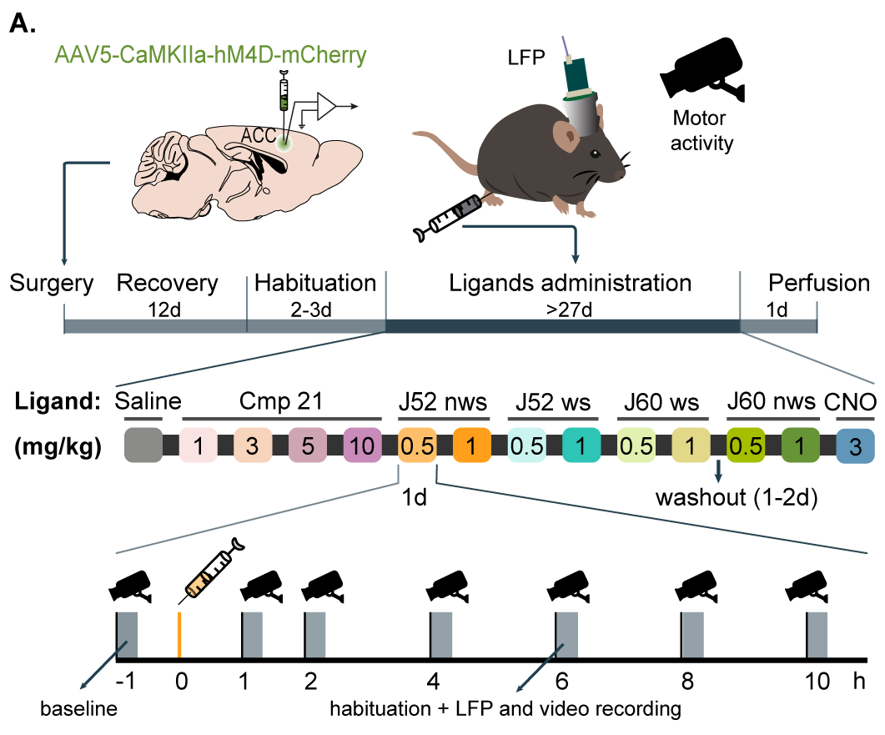

Note* This version integrates the suggestions given by François-Xavier 
# I. Introduction

This R Notebook is dedicated to the analysis of experimental data
obtained from a series of experiments designed to evaluate the effects
of various DREADD compounds administered by injections at different
doses over time on the activity levels of test subjects. The subjects'
activity metrics were derived from video recordings by processing the
body center's instantaneous speed. These metrics are analyzed to assess
the potential impacts of the compounds, focusing on key measurements.

## Study design



**Subjects:** 4 subjects.

-   **Treatments:**

    -   **Compounds and Doses:** A combination of 4 different compounds,
        each administered at different doses, resulting in unique
        compound-dose combinations.

-   **Control:** To ensure reliable analysis, two control conditions are
    incorporated:

    -   **Baseline activity:** Measurements of activity metrics before
        the injection of any compound, used to account for the subject's
        normal activity levels.
    -   **Saline injections:** A control condition where saline was
        injected instead of a compound, to determine whether observed
        effects are due to the compounds or just the injection process.

-   **Timing:**

    -   **Baseline Recording:** 1 hour before any injection (-1h).
    -   **Post-Injection Recordings:** 1 hour, 2 hours, 4 hours, 6
        hours, and 10 hours after each injection. Each unique
        compound-dose combination was administered once per subject, and
        each administration occurred on a different day.

-   **Data collection**

    -   **Activity Measurement:** Behavior was video recorded for 10
        minutes after each injection.

-   **Metrics extracted:** The following metrics were calculated from
    the video-recordings:

    1.  **High activity (%)**: The percentage of time the subject's
        activity was classified as high, indicating periods of
        significant movement. It helps to evaluate the extent to which
        the compound increases or maintains high levels of activity.

    2.  **Low activity (%)**: The percentage of time the subject's
        activity was classified as low, reflecting periods of minimal
        movement. It is useful for understanding whether the compound
        induces lethargy or reduces overall activity.

    3.  **Occlusion (%)**: The percentage of time during which the
        subject could not be tracked due to occlusion, meaning the
        subject's body center was not visible or measurable. This metric
        is essential for assessing the quality and reliability of the
        tracking data.

    4.  **Mean (px/s)**: The mean speed of the subject's body center
        over the entire recording period. This provides a general sense
        of the subject's overall activity level and is a direct
        indicator of how the compound might influence average movement
        speed.

    5.  **Standard deviation (px/s)**: This measures the variability in
        the subject's speed, reflecting how consistent or varied their
        activity was during the recording period. High variability might
        indicate erratic behavior, while low variability could suggest
        consistent activity levels.

    6.  **Activity Distribution Ratios (ADR):**

        1.  **ADR Low/High+Occ**: The Activity Distribution Ratio (ADR)
            between low activity and the combined time of high activity
            and occlusion periods. This ratio helps to understand the
            relative dominance of low activity compared to periods of
            high activity or times when the subject was not trackable.

        2.  **ADR Low/High**: The Activity Distribution Ratio (ADR)
            between low and high activity periods. This metric is
            crucial for comparing the balance between periods of low and
            high activity, indicating how a compound may shift the
            subject's behavior towards more or less activity.

    7.  **Skewness:**

        1.  **Skewness low**: The skewness of the low activity
            distribution over time, indicating whether low activity
            periods are more concentrated at certain times during the
            experiment. A positive skew suggests that low activity
            occurs more frequently towards the end, while a negative
            skew indicates it is more common at the beginning.

        2.  **Skewness high**: The skewness of the high activity
            distribution over time, similar to the low activity skewness
            but focusing on periods of high activity. This metric helps
            to determine whether high activity is more likely at
            specific times during the experiment.

    8.  **Normalized entropy**: This metric represents the entropy of
        the activity distribution (AD) across the entire recording,
        normalized to a maximum entropy value. Entropy measures the
        randomness or unpredictability of the activity states (high,
        low, occlusion). A higher normalized entropy suggests a more
        even distribution of these states, while lower entropy indicates
        that one state is dominant."

        **Experiments done**

        

## Objectives

The primary objectives of this analysis are:

1.  **Quantify the Effects of Compounds and Doses:** Determine whether
    the different compounds and their doses significantly impact certain
    activity metrics, compared against the saline control.

2.  **Assess Dose-Response Relationships:** Explore how different doses
    influence the observed effects, and whether there is an interaction
    between compound type and dose.

3.  **Time-Dependent Changes:** Analyze how activity metrics evolve over
    time post-injection to identify any time-dependent effects of the
    compounds and how these compare to the saline injection.

4.  **Control for Baseline Activity:** 

# II. Data preparation

## 1. Load and check data structure

```{r setup, include=FALSE}

knitr::opts_chunk$set(echo = FALSE, cache = FALSE) # To remove code in HTML output

rm(list = ls()) # Clear environment
cat("\014") # Clear console

# Load libraries
library(ggpubr)  # For statistical tests and plotting
library(dplyr)   # For data manipulation
library(ggplot2) # For data visualization
library(lme4)    # For mixed-effects models
library(corrplot) # For correlation plots
library(ggbiplot) # For PCA plots
library(ggthemes) # Additional themes for ggplot
library(skimr)    # Summary statistics
library(psych)    # Descriptive statistics
library(glmmTMB)

```

```{r, echo =FALSE}

file_path = "D:/OneDrive - ICM/Liz_NeuroMatlab/DLC_PoseAnalysis/Results/results.csv"

# Read the first line of the file
first_line <- readLines(file_path, n = 1)
# Check if it's comma-separated or tab-separated
sep <- if (grepl(",", first_line)) "," else ";"
# Read the file with the correct separator
data <- read.csv(file_path, sep = sep)

# View the first few rows to ensure the data has been loaded correctly
# head(data)

# Separate the relevant metadata (experiment descriptors) and the actual results
metadata <- data[, 1:4]   # Columns 1 to 4: ID, Compound, Dose, Post-injection time
results <- data[, 11:20]  # Columns 11 to 20: High activity percentage to entropy

# Convert the Compound column to a factor and Dose to numeric
metadata$Compound <- as.factor(metadata$Compound)
# Convert 'ID' to a factor
metadata$ID <- as.factor(metadata$ID)

# Convert 'Dose' to numeric by replacing commas with periods
metadata$Dose..mg.kg. <- gsub(",", ".", metadata$Dose..mg.kg.)  # Replace commas with periods
metadata$Dose..mg.kg. <- as.numeric(metadata$Dose..mg.kg.)  # Convert to numeric

# Ensure 'Saline' is included as part of 'Treatment'
metadata$Compound <- factor(metadata$Compound, levels = c("Saline", "21", "cno", "j60nws", "j60ws", "j52nws", "j52ws"))

# Convert 'Post Injection' column, where 0 represents Baseline
metadata$Post.injection <- as.numeric(metadata$Post.injection..h.)  # Assuming 0 = baseline

# Baseline activity: use the 'Post Injection' column to create a baseline indicator
metadata$Is_Baseline <- ifelse(metadata$Post.injection..h. == 0, 1, 0)  # 1 = Baseline, 0 = Post-injection

# Combine metadata with results for further analysis
data_combined <- cbind(metadata, results)

# Set custom levels for 'Treatment' to maintain the order of interest
custom_order <- c("Saline", "21", "cno", "j60nws", "j60ws", "j52nws", "j52ws")
data_combined$Compound <- factor(data_combined$Compound, levels = custom_order)


# Check the structure of the data, ensuring all variables are correctly formatted
# str(data_combined)

# Summary statistics of the results for exploration
summary_results <- describe(results)
summary_results

```

## 2. Exploratory Data Analysis (EDA)

Assessing the distribution of activity metrics across different
compounds, doses, and time points.

```{r}

# Summary statistics for key metrics grouped by Compound, Dose, 
# Post_Injection time, and Subject ID
summary_stats <- data_combined %>%
  group_by(Compound, Dose..mg.kg., Post.injection..h., ID) %>%
  summarise(
    mean_high_activity = round(mean(High.activity.percentage, na.rm = TRUE), 2),
    mean_low_activity = round(mean(Low.activity.percentage, na.rm = TRUE), 2),
    mean_occlusion = round(mean(Occlusion.percentage, na.rm = TRUE), 2),
    mean_speed = round(mean(Mean, na.rm = TRUE), 2),
    sd_speed = round(mean(Std.deviation, na.rm = TRUE), 2),
    mean_adr_low_high_occ = round(mean(ADR.Low.High.Occ, na.rm = TRUE), 2),
    mean_adr_low_high = round(mean(ADR.Low.High, na.rm = TRUE), 2),
    mean_skewness_low = round(mean(skewness_low, na.rm = TRUE), 2),
    mean_skewness_high = round(mean(skewness_high, na.rm = TRUE), 2),
    mean_entropy = round(mean(normalized.entropy, na.rm = TRUE), 2)
  )

# Print the summary statistics
# print(summary_stats)
```


#### 2.1 Box plots for all raw data (dependent variables)

```{r}
# Define custom color palette
color_palette <- c(
  "21_1" = "#fae3e3",   # Misty rose
  "21_3" = "#f7d4bc",   # Desert sand
  "21_5" = "#cfa5b4",   # Pink lavander
  "21_10" = "#c98bb9",  # African violet                        
  "j52nws_0.5" = "#ffbf69",  # Hunyadi yellow
  "j52nws_1" = "#ff9f1c",    # Orange peel
  "j52ws_0.5" = "#cbf3f0",   # Mint green
  "j52ws_1" = "#2ec4b6",     # Light sea green
  "j60nws_0.5" = "#e2f1af",  # Tea green
  "j60nws_1" = "#e3d888",    # Flax
  "j60ws_0.5" = "#a5be00",   # Apple green
  "j60ws_1" = "#679436",     # Asparagus
  "cno_3" = "#6096ba",       # Air blue
  "Saline_0" = "#8b8c89"     # Battleship gray
)


data_combined <- data_combined %>%
  mutate(Compound_Dose = paste(Compound, Dose..mg.kg., sep = "_"))

# Ensure 'Compound_Dose' is treated as a factor with levels based on the custom color palette
data_combined$Compound_Dose <- factor(data_combined$Compound_Dose, levels = names(color_palette))


# Function to generate the plot with consistent y-axis limits
plot_metric <- function(metric_name, y_label) {
  # Calculate the global min and max for the metric across all groups
  y_min <- min(data_combined[[metric_name]], na.rm = TRUE)
  y_max <- max(data_combined[[metric_name]], na.rm = TRUE)
  
   median_data <- data_combined %>%
    group_by(Post.injection..h., Compound_Dose) %>%
    summarize(median_value = median(.data[[metric_name]], na.rm = TRUE), .groups = 'drop')
  
  ggplot(data_combined, aes(x = as.factor(Post.injection..h.), y = .data[[metric_name]], fill = Compound_Dose)) +
    geom_boxplot(outlier.shape = NA, alpha = 0.6) +  # Suppress outliers to avoid double plotting
    geom_line(data = median_data, aes(x = as.factor(Post.injection..h.), y = median_value, group = Compound_Dose, color = Compound_Dose), size = 1) +  # Connect the median values
    geom_jitter(color = "black", width = 0.2, alpha = 0.7, size = 1) +   # Add jittered individual points
    facet_wrap(~ Compound_Dose, scales = "fixed", ncol = 4) +
    labs(title = paste(y_label, "by Time Point and Compound+Dose"),
         x = "Post-Injection Time (hours)", y = y_label) +
    scale_fill_manual(values = color_palette) +
    scale_color_manual(values = color_palette) +  # Color points to match fill colors
    expand_limits(y = c(y_min, y_max)) +  # Apply the global min and max to all subplots
    theme_classic() +
    theme(
      axis.text.x = element_text(angle = 0, hjust = 1),
      strip.text = element_blank(),  # Remove facet labels
      panel.spacing = unit(0.5, "lines"),  # Control spacing between panels
      axis.line = element_line(color = "black"),  # Ensure axis lines are visible
      axis.ticks = element_line(color = "black"),  # Ensure ticks are visible
      panel.border = element_rect(fill = NA, color = "black")  # Add a border around each panel
    )
}

# Generate plots for all 10 metrics
p_high_activity <- plot_metric("High.activity.percentage", "High Activity Percentage")
p_low_activity <- plot_metric("Low.activity.percentage", "Low Activity Percentage")
p_mean_speed <- plot_metric("Mean", "Mean Speed (px/s)")
p_sd_speed <- plot_metric("Std.deviation", "Speed Standard Deviation (px/s)")
p_occlusion <- plot_metric("Occlusion.percentage", "Occlusion Percentage")
p_adr_low_high_occ <- plot_metric("ADR.Low.High.Occ", "ADR Low/High+Occ")
p_adr_low_high <- plot_metric("ADR.Low.High", "ADR Low/High")
p_skewness_low <- plot_metric("skewness_low", "Skewness Low")
p_skewness_high <- plot_metric("skewness_high", "Skewness High")
p_entropy <- plot_metric("normalized.entropy", "Normalized Entropy")

# Display one of the plots (e.g., High Activity)
p_high_activity
p_low_activity
p_mean_speed
p_sd_speed
p_occlusion
p_adr_low_high_occ
p_adr_low_high
p_skewness_low
p_skewness_high
p_entropy

```

#### 2.2 Evaluate baseline Variability 
In our data we have to handle a missing baseline. 
Option 1: Assign the subject's average baseline (subject's baseline measurements are consistent across different sessions and are not influenced by factors such as time, prior treatments, or physiological changes)
Option 2:  Exclude the Drug-Dose Combination for That Subject --> Not an optionbecause few subjects


```{r}

# BASELINE HOMOGENEITY 

# Assessing baseline homogeneity to decide if (1) I use baseline as a covariate in my models (controling for individual diferences at the start of the study) or (2) if I normalize the data to Baseline (focus on relative changes and eventually reduce variability).

# Extract baseline data (Post.injection..h. == 0)
baseline_data <- data_combined %>%
  filter(Post.injection..h. == 0)

# Metrics to analyze
metrics_to_analyze <- c("ADR.Low.High.Occ", "High.activity.percentage", 
                        "skewness_low", "skewness_high", "normalized.entropy")

# Extract baseline data
baseline_data <- data_combined %>%
  filter(Is_Baseline == 1) %>%
  select(ID, Compound, Dose..mg.kg., Compound_Dose, all_of(metrics_to_analyze))

# Check for missing baselines
missing_baselines <- baseline_data %>%
  filter(is.na(ADR.Low.High.Occ) | is.na(High.activity.percentage) |
           is.na(skewness_low) | is.na(skewness_high) | is.na(normalized.entropy))

# View missing baselines
missing_baselines

# Calculate descriptive statistics for each subject
baseline_stats <- baseline_data %>%
  group_by(ID) %>%
  summarise(
    count = n(),
    mean_ADR = mean(ADR.Low.High.Occ, na.rm = TRUE),
    sd_ADR = sd(ADR.Low.High.Occ, na.rm = TRUE),
    cv_ADR = (sd_ADR / mean_ADR) * 100,
    mean_HighActivity = mean(High.activity.percentage, na.rm = TRUE),
    sd_HighActivity = sd(High.activity.percentage, na.rm = TRUE),
    cv_HighActivity = (sd_HighActivity / mean_HighActivity) * 100,
    mean_SkewnessLow = mean(skewness_low, na.rm = TRUE),
    sd_SkewnessLow = sd(skewness_low, na.rm = TRUE),
    cv_SkewnessLow = (sd_SkewnessLow / mean_SkewnessLow) * 100,
    mean_SkewnessHigh = mean(skewness_high, na.rm = TRUE),
    sd_SkewnessHigh = sd(skewness_high, na.rm = TRUE),
    cv_SkewnessHigh = (sd_SkewnessHigh / mean_SkewnessHigh) * 100,
    mean_Entropy = mean(normalized.entropy, na.rm = TRUE),
    sd_Entropy = sd(normalized.entropy, na.rm = TRUE),
    cv_Entropy = (sd_Entropy / mean_Entropy) * 100
  )

# View baseline statistics
print(baseline_stats)

# Visualize baseline variability for each metric
# Function to plot baseline measurements per subject
plot_baseline_variability <- function(metric_name, y_label) {
  ggplot(baseline_data, aes(x = ID, y = .data[[metric_name]])) +
    geom_boxplot(outlier.shape = NA, alpha = 0.6, fill = "#69b3a2") +
    geom_jitter(color = "black", width = 0.2, alpha = 0.7, size = 1) +
    labs(title = paste("Baseline", y_label, "by Subject"),
         x = "Subject ID", y = y_label) +
    theme_classic() +
    theme(
      axis.text.x = element_text(angle = 45, hjust = 1)
    )
}

# Plot for each metric
p_ADR <- plot_baseline_variability("ADR.Low.High.Occ", "ADR Low/High+Occ")
p_HighActivity <- plot_baseline_variability("High.activity.percentage", "High Activity (%)")
p_SkewnessLow <- plot_baseline_variability("skewness_low", "Skewness Low")
p_SkewnessHigh <- plot_baseline_variability("skewness_high", "Skewness High")
p_Entropy <- plot_baseline_variability("normalized.entropy", "Normalized Entropy")

# Display the plots
print(p_ADR)
print(p_HighActivity)
print(p_SkewnessLow)
print(p_SkewnessHigh)
print(p_Entropy)
```

#### 2.3 Normality test

**Check normality of the response variables:**

```{r}
# Set up the plot layout to have 2 rows: 1 for the histogram and 1 for the Q-Q plot
par(mfrow = c(1, 2))  # 2 rows, 1 column layout

# List of metrics to iterate over
metrics <- list(
  ADR.Low.High.Occ = data_combined$ADR.Low.High.Occ,
  High.activity.percentage = data_combined$High.activity.percentage,
  skewness_low = data_combined$skewness_low,
  skewness_high = data_combined$skewness_high,
  normalized_entropy = data_combined$normalized.entropy
)

# Loop through each metric and create both histogram and Q-Q plot
for (metric_name in names(metrics)) {
  metric_data <- metrics[[metric_name]]
  
  # Plot Histogram
  hist(metric_data, main = paste("Histogram of", metric_name), xlab = metric_name, col = "lightblue", border = "black")
  
  # Plot Q-Q plot
  qqnorm(metric_data, main = paste("Q-Q Plot of", metric_name))
  qqline(metric_data, col = "red")
}

# Reset layout back to 1 plot per figure
par(mfrow = c(1, 1))

# ------

# Define a function to perform the Shapiro-Wilk test and determine normality
check_normality <- function(data, variable_name) {
  test_result <- shapiro.test(data[[variable_name]])
  p_value <- test_result$p.value
  
  if (p_value < 0.05) {
    return(paste(variable_name, ": Not normally distributed (p-value =", round(p_value, 3), ")"))
  } else {
    return(paste(variable_name, ": Normally distributed (p-value =", round(p_value, 3), ")"))
  }
}

# List of variables to check
variables <- c("ADR.Low.High.Occ", "High.activity.percentage", "skewness_low", "skewness_high", "normalized.entropy")

# Apply the function to each variable and print the result
for (var in variables) {
  result <- check_normality(data_combined, var)
  print(result)
}

```

# III. Identify variables

## Independent Variables (predictor variables)

-   **Compound_Dose (Categorical)**: A categorical variable representing
    different drug-dose combinations. Each unique combination of
    compound and dose. This approach treats each unique combination as a
    separate level of a single categorical variable to:

    -   Simplify the model structure: Make the model easier to
        interpret, because there are a lot of interactions between
        compound and dose (interaction terms are reduced).

    -   Handle missing combinations: I will also considered it as this
        in this analsis to handle imbalance data as not all compounds
        were injected at every dose.

    -   Allow for direct comparison of the effects of compound-dose
        combinations.

    -   Saline is part of Compound_dose and included as a reference
        level.

-   **Time Post-Injection (Continous)**: A continuous variable
    representing time post-injection measurements (1h, 2h, 4h, 6h, 10h).

-   **Baseline (Categorical)**: A binary variable called Is_Baseline (1
    = baseline, 0 = post-injection) will adjusts the model to account
    for differences between baseline (pre-injection) and post-injection
    activity. Pre-injection control at -1 hour. It is included as a
    covariate to control for individual differences in activity levels
    before the drug administration. It affects both saline and drug-dose
    conditions, controlling for general pre/post-injection differences.

## Dependent Variables (response variable)

These are the selected dependent variable, shown to be continuous and
non-normally distributed as shown by the Sharpiro test .

1.  ADR.Low.High.Occ

2.  High Activity (%)

3.  Skewness Low

4.  Skewness High

5.  Normalized Entropy

## Random effects and repeated measures

-   **Subject ID (Categorical)**: Each subject’s unique variability is
    accounted for as a random effect. Plus, we do not have a large
    diverse sample to not consider the subject-specific variability as
    not relevant.
-   Because the subjects are observed at different time points in a day,
    therefore the measurements are not independent (they are from the
    same subject), the subject needs to be modeled as a random effect to
    account for the correlation between these repeated measurements

**Unbalanced Data:** Beacause each compound does not have the same
number or types of doses.

**Interaction effects**: Explore interactions between compound_dose and
time post-injection since the compound effect may vary depending on
this.

# IV. Selection of dependent variables

A correlation matrix and PCA biplot are nice tools for selecting the
variables that are most suitable for our research question, but that
also that maximize relevance, while minimizing multicollinearity and
redundancy.

## Correlation matrix

**Reminders:**

-   A correlation matrix ensures that your chosen dependent variables
    are not redundant or highly correlated with each other, leading to
    better model selection and performance.

-   Correlation close to +1 means there is a strong positive correlation
    between the two variables, this suggests that the two variables move
    in the same direction.

```{r}

# Calculate the correlation matrix for the metrics
metrics <- c("High.activity.percentage", "Low.activity.percentage", "Mean", "Std.deviation","Occlusion.percentage",
             "ADR.Low.High.Occ", "ADR.Low.High", "skewness_low", "skewness_high", "normalized.entropy")

correlation_matrix <- cor(data_combined[, metrics], use = "complete.obs")

# Plot the correlation matrix as a heatmap
library(corrplot)
corrplot(correlation_matrix, method = "color", type = "lower", 
         tl.col = "black", tl.srt = 45, 
         addCoef.col = "black", number.cex = 0.7)

```

**Main results and their interpretation:**

**High** Strong positive linear relationship:

-   **Std.deviation and Mean**: the average speed of the subject
    increases, the variability in their speed also increases suggesting
    that subjects that are moving faster on average tend to have more
    variability in their speed, indicating that higher speed is
    associated with more erratic or varied movement patterns.

-   **ADR Low/High+Occlusion and Low activity percentage**: the
    percentage of time spent in low activity increases, the ratio of low
    activity to other states also increases. *What This Means:* When
    subjects spend more time in low activity, it significantly dominates
    their behavior relative to periods of high activity and times when
    they are not trackable. --\> Not a surprise, maybe use one metrics
    only for the stats.

-   **ADR Low/High and Low activity percentage:** the percentage of time
    spent in low activity increases, the ratio of low to high activity
    also increases. *What This Means*: Subjects that spend more time in
    low activity have a much greater proportion of low activity compared
    to high activity, reinforcing the idea that certain compounds might
    be reducing overall activity levels.--\> Not a surprise, maybe use
    one metrics only for the stats.

-   **ADR Low/High and Low and ADR Low/High+Occlusion:** as the ratio of
    low to high activity increases, so does the ratio of low activity to
    the combination of high activity and occlusion. *What this means:*
    This correlation indicates that the dominance of low activity is
    consistent whether considering just high activity or including
    periods of occlusion. It reinforces that subjects with higher low
    activity tend to have lower periods of high activity, regardless of
    occlusion.--\> Not a surprise, maybe use one metrics only for the
    anova.

**Moderate** positive linear relationship:

-   **Normalized entropy and Occlusion percentage**: Higher occlusion
    rates, where the subject's movement cannot be tracked, lead to a
    more unpredictable and evenly distributed activity state. This could
    indicate that occlusion introduces uncertainty in tracking, leading
    to higher entropy values. --\> Not a surprise, videos with occlusion
    \> 20% have been identified and shifted to windows with less
    occlusion (most videos have between 0 - 5%).

-   **Normalized entropy and High activity**: Subjects with more high
    activity time also exhibit more variability and transitions between
    activity states (i.e., they switch more frequently between high and
    low activity or occlusion states).

::: {style="color:#ff6347"}
**General conclusion:** The analysis reveals that subjects with higher
average speeds exhibit more variable movement patterns, suggesting that
increased activity often leads to more erratic behavior. Additionally,
higher low activity percentages correlate strongly with higher ratios of
low activity to other states. To avoid multicollinearity and focus on
the most informative metrics, I would suggest to concentrate on the
**`ADR Low/High + Occlusion`** metric in further analyses, and exclude
redundant metrics like `ADR Low/High`, and `Low activity percentage`
:::

## PCA Biplot

**Reminder:** This is a useful analysis to:

1.  Identify which metrics are most influential in explaining the
    variance in my data.

2.  Reduce dimensionality: How many metrics I need to consider (the
    first principal components)?. These are the ones I should focus, and
    ignore the others, to simplify my analysis.

3.  Are there distinct groups of observations? The positions of the
    points (scores) can reveal if there are natural groupings of your
    subjects or experiments. This might suggest that certain compounds
    or doses lead to similar activity patterns.

```{r}
# Load necessary libraries
library(ggbiplot)
library(ggplot2)
library(viridis)

# List of metrics to include in PCA
metrics <- c("High.activity.percentage", "Mean", 
              "Occlusion.percentage", "ADR.Low.High.Occ", 
              "skewness_low", "skewness_high", "normalized.entropy")

# Perform PCA on the standardized metrics
pca_result <- prcomp(data_combined[, metrics], scale. = TRUE)

# Summary of PCA to see the proportion of variance explained by each component
summary(pca_result)

# Plot the PCA biplot
pca_biplot <- ggbiplot(pca_result, ellipse = TRUE, obs.scale = 1, var.scale = 1,
                       groups = data_combined$Compound_Dose, 
                       varname.size = 4, alpha = 0.6) +
  scale_color_viridis(discrete = TRUE, name = '') +  # Using viridis color palette
  theme_minimal() +
  labs(title = "PCA Biplot of Activity Metrics",
       x = paste("Principal Component 1 (", round(summary(pca_result)$importance[2,1] * 100, 1), "%)", sep = ""),
       y = paste("Principal Component 2 (", round(summary(pca_result)$importance[2,2] * 100, 1), "%)", sep = ""))

# Print the biplot
print(pca_biplot)

# Extract the loadings (eigenvectors) for each principal component
loadings <- pca_result$rotation

# View the loadings for PC1 and PC2
loadings_pc1_pc2 <- loadings[, 1:2]
print(loadings_pc1_pc2)

# Identify the metrics with the highest absolute loadings on PC1 and PC2
high_loadings_pc1 <- sort(abs(loadings_pc1_pc2[, 1]), decreasing = TRUE)
high_loadings_pc2 <- sort(abs(loadings_pc1_pc2[, 2]), decreasing = TRUE)

cat("Metrics contributing most to PC1:\n")
print(names(high_loadings_pc1[1:3])) # Top 3 metrics for PC1

cat("\nMetrics contributing most to PC2:\n")
print(names(high_loadings_pc2[1:3])) # Top 3 metrics for PC2

# ---

# Convert loadings to a data frame
loadings_df <- as.data.frame(loadings_pc1_pc2)
loadings_df$Metric <- rownames(loadings_df)

# Create a custom theme
custom_theme <- theme_minimal(base_size = 14) +
  theme(axis.text.x = element_text(angle = 45, hjust = 1),
        plot.title = element_text(hjust = 0.5, face = "bold"))

# Plot for PC1
ggplot(loadings_df, aes(x = reorder(Metric, abs(PC1)), y = abs(PC1))) +
  geom_bar(stat = "identity", fill = viridis(7)[4], color = "black", width = 0.7) +
  coord_flip() +
  labs(title = "Absolute Loadings on PC1", 
       x = "Metrics", 
       y = "Absolute Loading") +
  geom_text(aes(label = round(abs(PC1), 2)), hjust = -0.2, color = "black", size = 4) +
  custom_theme

# Plot for PC2
ggplot(loadings_df, aes(x = reorder(Metric, abs(PC2)), y = abs(PC2))) +
  geom_bar(stat = "identity", fill = viridis(7)[2], color = "black", width = 0.7) +
  coord_flip() +
  labs(title = "Absolute Loadings on PC2", 
       x = "Metrics", 
       y = "Absolute Loading") +
  geom_text(aes(label = round(abs(PC2), 2)), hjust = -0.2, color = "black", size = 4) +
  custom_theme

```

**Main results and their interpretation:**

-   **Arrows (Loadings):** Metrics with longer arrows are more
    influential. Metrics pointing in the same direction are positively
    correlated. Mean speed seems to not be influential --\> Remove it.

-   **Points (Scores):** Clustering of points indicates that those
    observations have similar patterns. In this case no clear cluster
    appear in the data.

::: {style="color:#ff6347"}
**General conclusion: Prioritizing Metrics:** Key metrics to prioritize
based on PCA:

-   **ADR.Low.High.Occ:** Captures the balance between low and high
    activity and contributes significantly to explaining the variance in
    the data.
-   **High activity (%):** Indicates periods of significant movement,
    and its negative relationship with PC1 suggests it could reflect a
    different behavioral pattern than ADR.
-   **Normalized entropy:** Reflects the unpredictability or randomness
    in activity states, contributing meaningfully to PC1.
-   **Skewness low and Skewness high:** Important for understanding the
    timing of activity, particularly if we are interested in when during
    the experiment certain activities (high or low) occur.

Secondary metrics that we will not consider for this analysis (to
simplify):

-   Mean (px/s): This metric didn’t contribute as strongly to PC1 or
    PC2, but it could still be useful as a general indicator of
    movement.
-   Occlusion (%): Its contribution to both components is relatively
    low, so it might not be as crucial unless you have specific concerns
    about data quality due to tracking issues.
:::

# V. Generalized Linear Mixed Models.

We will fit separate GLMMs for each of the dependent variables using the
appropriate link functions.

```{r}
# Declare functions 

# 1. Function to Fit GLMM
fit_glmm <- function(formula, data, family, optimizer = "bobyqa") {
  glmer(formula, data = data, family = family, control = glmerControl(optimizer = optimizer))
}

# 2. Function to Fit LMM
fit_lmm <- function(formula, data) {lmer(formula, data = data)
}

# 3. Function to Summarize Model
summarize_model <- function(model) {
  summary(model)
}

# Function to Plot Residuals
plot_residuals <- function(model, title) {
  residuals <- resid(model, type = "pearson")
  fitted <- fitted(model)
  ggplot(data.frame(fitted, residuals), aes(x = fitted, y = residuals)) +
    geom_point() +
    geom_hline(yintercept = 0, linetype = "dashed", color = "red") +
    labs(title = title, x = "Fitted values", y = "Residuals") +
    theme_minimal()
}

# Function to Perform Goodness-of-Fit Test
check_gof <- function(model) {
  model_family <- family(model)$family
  
  if (model_family == "beta") {
    # For beta family
    pearson_residuals <- residuals(model, type = "pearson")
    ss_residuals <- sum(pearson_residuals^2)
    df_resid <- df.residual(model)
    p_value <- pchisq(ss_residuals, df_resid, lower.tail = FALSE)
    
    return(list(
      ss_residuals = ss_residuals,
      df_resid = df_resid,
      p_value = p_value,
      family = "beta"
    ))
    
  } else if (model_family == "gaussian") {
    # For Gaussian family
    deviance <- deviance(model)
    df_resid <- df.residual(model)
    p_value <- pchisq(deviance, df_resid, lower.tail = FALSE)
    
    return(list(
      deviance = deviance,
      df_resid = df_resid,
      p_value = p_value,
      family = "gaussian"
    ))
    
  } else {
    stop("Unsupported model family")
  }
}

```

### 1. ADR.Low.High.Occ (Log Link)

```{r}
# Making sure Saline is the Reference level
custom_order <- c("Saline_0", "21_1", "21_3", "21_5", "21_10",
                  "j52nws_0.5", "j52nws_1", "j52ws_0.5", "j52ws_1",
                  "j60nws_0.5", "j60nws_1", "j60ws_0.5", "j60ws_1", 
                   "cno_3")
data_combined$Compound_Dose <- factor(data_combined$Compound_Dose, levels = custom_order)

# Fit the model
glmm_adr <- fit_glmm(ADR.Low.High.Occ ~ Compound_Dose * Post.injection..h. 
                     + Is_Baseline +
                     (1 | ID), data_combined, 
                     family = gaussian(link = "log"))

# Summarize the model
summarize_model(glmm_adr)

# Plot residuals
plot_residuals(glmm_adr, "Residuals for ADR.Low.High.Occ (Log Link)")

# Goodness-of-fit test
gof_adr <- check_gof(glmm_adr)
gof_adr

```

```{r}
# MEETING WITH FRANCOIS-XAVIER 

# Making sure Saline is the Reference level
custom_order <- c("Saline_0", "21_1", "21_3", "21_5", "21_10",
                  "j52nws_0.5", "j52nws_1", "j52ws_0.5", "j52ws_1",
                  "j60nws_0.5", "j60nws_1", "j60ws_0.5", "j60ws_1", 
                   "cno_3")
data_combined$Compound_Dose <- factor(data_combined$Compound_Dose, levels = custom_order)

# Fit the model
glmm_adr <- fit_glmm(ADR.Low.High.Occ ~ Compound_Dose * Post.injection..h. 
                     + Is_Baseline +
                     (1 | ID), data_combined, 
                     family = gaussian(link = "log"))

# Summarize the model
summarize_model(glmm_adr)

# Plot residuals
plot_residuals(glmm_adr, "Residuals for ADR.Low.High.Occ (Log Link)")

# Goodness-of-fit test
gof_adr <- check_gof(glmm_adr)
gof_adr
```

**Metric Definition:**

-   **ADR Low/High+Occ.** This metric measures the ratio of the
    percentage of time spent in low activity to the combined percentage
    of time spent in high activity and occlusion. It helps in
    understanding how much low activity dominates compared to periods of
    high activity or when the subject is not trackable.

Since this is a ratio and not normally distributed, the log link
function is suitable. It handles positive, skewed data by modeling the
logarithm of the outcome, which can help stabilize variance and
normalize the distribution.

-   **Current Model:** The model fits reasonably well for the
    ADR.Low.High.Occ data, as indicated by the goodness-of-fit test,
    where the p-value is nearly 1.The residuals plot also suggests that
    the model accurately captures the observed data.

-   **Random effects:** The variability between subjects is small, with
    a standard deviation of 0.06771. This suggests that individual
    differences between subjects contribute minimally to the overall
    variability in ADR.Low.High.Occ.

The residual variance (0.587214) is much larger compared to the variance
due to differences between subjects (0.004585). This suggests that most
of the variability in ADR.Low.High.Occ is explained by the fixed effects
(e.g., different Compound_Dose levels, Time Post-Injection, etc.) and
other unexplained factors (residual variance), rather than by inherent
differences between subjects. Thus, the fixed effects play a much bigger
role in explaining how ADR.Low.High.Occ changes than any inherent
differences between the subjects themselves.

-   **Fixed effects:**
    -   **Intercept:** The baseline level of ADR.Low.High.Occ is
        significant, indicating that there is a meaningful base level of
        this metric even without any other predictors.

    -   **Compound_Dose Effects:** No individual compound-dose
        combination shows a significant difference from the reference
        (Saline), meaning these treatments do not drastically change
        ADR.Low.High.Occ. This suggests that these treatments do not
        significantly alter the balance between low activity and high
        activity/occlusion.

    -   **Time and Baseline:** Time post-injection has a non-significant
        effect on ADR.Low.High.Occ, indicating that the ratio does not
        consistently change over time across all treatments. The
        baseline effect is also not significant, suggesting that the
        activity distribution ratio does not differ significantly
        between baseline and post-injection periods.

    -   **Significant Interaction:** Some interactions between specific
        compound-dose combinations and time post-injection (**j60nws_1
        and j60ws_1**) are significant. These interactions suggest (they
        are negative estimates) that for these specific combinations,
        the ADR.Low.High.Occ decreases over time, indicating a shift
        away from low activity dominance as time progresses after
        injection. This suggests that the compounds may induce greater
        activity (or erratic movement) over time, reducing the periods
        of low activity.

::: {style="color:#ff6347"}
**Main Finding:** : The primary conclusion is that most compound-dose
combinations do not significantly affect ADR.Low.High.Occ, except for
notable interactions with the **j60nws_1 and j60ws_1** combinations,
where the ratio tends to decrease over time. This could suggest that
these specific treatments reduce the dominance of low activity as time
post-injection increases. **Implication**: This finding could indicate
that these compounds have a stimulating effect over time.

Note: CNO does not have a significant positive estimate as we might
expect according to previous publications.

**Model Consideration:** The lack of significant effects might suggest
that the compounds, in general, have limited impact on this metric or
that the sample size and variability are too high to detect subtle
effects.

**Goodness of fit:** A value of P = 0.99 indicates that the model fits
the data exceptionally well.
:::

### 2. High Activity (%) (Logit Link)

```{r}
# Scale High.activity.percentage to be between 0 and 1
data_combined$High_activity_proportion <- data_combined$High.activity.percentage / 100

# Fit the beta regression mixed model
glmm_high_activity <- glmmTMB(High_activity_proportion ~ Compound_Dose * Post.injection..h. + Is_Baseline + 
                      (1 | ID), 
                      data = data_combined, 
                      family = beta_family())

# Summarize the model
summary(glmm_high_activity)

# Plot residuals
plot_residuals(glmm_high_activity, "Residuals for High Activity (%) (Beta)")

# Goodness-of-fit test
gof_high_activity <- check_gof(glmm_high_activity)
gof_high_activity

```

**Metric Definition:**

-   **High Activity Proportion:** This metric represents the proportion
    of time that the subjects spent in high activity during the
    observation period. It is a key indicator of how active the subjects
    are under different compound-dose combinations over time.

-   **Current Model:** The model appears to fit the
    High_activity_proportion data well, as indicated by the
    goodness-of-fit test where the p-value is 1, suggesting that the
    model accurately captures the observed data. The AIC and BIC values
    are also indicative of a well-fitting model.

-   **Random effects:** The variability between subjects is small, with
    a standard deviation of 0.0729, which is relatively small. This
    suggests that individual differences between subjects contribute
    minimally to the overall variability in High_activity_proportion.
    Most of the variation is attributed to the fixed effects rather than
    differences between subjects.

**Fixed effects:**

-   **Intercept:**: The baseline level of High_activity_proportion is
    significant and negative, with an estimate of -0.9521. This suggests
    that, on average, the proportion of time spent in high activity is
    relatively low when all other predictors are at their baseline
    levels.
-   **Compound_Dose Effects:** None of the compound-dose combinations
    show a significant difference from the reference level (Saline_0),
    indicating that these treatments do not significantly alter the
    proportion of time spent in high activity.
-   **Time and Baseline:** The time post-injection has a marginally
    non-significant effect on High_activity_proportion (p = 0.0759),
    suggesting a slight tendency for high activity proportion to
    decrease over time, though this is not strong enough to be
    statistically conclusive. The baseline effect is also not
    significant, indicating no substantial difference in high activity
    proportion before and after injection across all subject.
-   **Significant Interactions:** Several significant interactions were
    observed for specific compound-dose combinations with time
    post-injection:
    -   **j60nws_0.5:Post.injection..h.:** The positive estimate
        (0.0451021) with a p-value of 0.02998 indicates that this
        combination is associated with an increase in high activity
        proportion over time.
    -   **j60nws_1:Post.injection..h.:** The positive estimate
        (0.0755080) with a p-value of 0.00185 is highly significant
        (\*\*), suggesting a strong increase in high activity proportion
        over time for this combination.
    -   **j60ws_1:Post.injection..h.:** The positive estimate
        (0.0654124) with a p-value of 0.00794 indicates a significant
        increase (\*\*) in high activity proportion over time for this
        combination.

::: {style="color:#ff6347"}
**Main Findings** The primary conclusion is that while most
compound-dose combinations do not significantly affect the
High_activity_proportion, the time-dependent effects observed in
combinations such as **j60nws_0.5, j60nws_1, and j60ws_1** highlight
specific scenarios where the proportion of time spent in high activity
increases as time progresses post-injection.These results are coherent
with the results from Low/High+Occlusion.

**Model Consideration:** The significant interaction effects suggest
that the model successfully captures the time-dependent changes in high
activity for certain compound-dose combinations, which is important for
understanding the dynamics of these treatments. The lack of significance
in many of the fixed effects might indicate that the overall impact of
these compounds on high activity proportion is limited, or that subtle
effects are only detected in specific combinations over time.

**Goodness of fit:**

The goodness-of-fit test shows that the model fits the data
exceptionally well, with a sum of squared residuals of 3.885033 and a
p-value of 1, indicating no significant discrepancy between the observed
data and the model's prediction
:::

### 3. Skewness Low (Identity Link)

```{r}
# The data is not normally distributed and is skewed towards the negative part.

# In this case I had to remove the random effect since i was having trouble with convergence of the model.
# When I included (1 | ID), the estimated variance for the random effect was extremely small (≈ 5.915e-08),This suggests that the random effect for ID was not contributing meaningfully to the model. A random effect with such a small variance means that the model is estimating almost no variability between different levels of ID. In other words, there's very little variation explained by the differences between individuals (ID), so the model treats each individual as having almost the same baseline response.

# I'm not sure if there is something else to do.reasonable to proceed without random effects. ?

# Option A) Il n'y a pas d'effets aléatoires, donc le modèle ne tente pas de capturer de la variabilité entre individus ou groupes. Cela suppose que la variabilité entre les observations est homogène et que toutes les différences entre elles peuvent être expliquées par les effets fixes.

# Option B) Should I fo fixed effects instead? (+ ID),  This treats each ID as having a unique effect that needs to be estimated directly, rather than assuming they're part of a random distribution.

# this is the comparison of both approaches, A and B: 

glmm_skewness_low <- glmmTMB(
  skewness_low ~ Compound_Dose * Post.injection..h. + Is_Baseline,
  data = data_combined, 
  family = gaussian()
)

# Summarize the model
summarize_model(glmm_skewness_low)

# Plot residuals
plot_residuals(glmm_skewness_low, "Residuals for Skewness Low (Identity Link)")

# Goodness-of-fit test
gof_skewness_low <- check_gof(glmm_skewness_low)
gof_skewness_low

glmm_fixed_ID <- glmmTMB(
  skewness_low ~ Compound_Dose * Post.injection..h.  + Is_Baseline + ID, 
  data = data_combined, 
  family = gaussian()
  )

# Summarize the model
summarize_model(glmm_fixed_ID)

# Plot residuals
plot_residuals(glmm_fixed_ID, "Residuals for Skewness Low (Identity Link)")

# Goodness-of-fit test
gof_glmm_fixed_ID <- check_gof(glmm_fixed_ID)
gof_glmm_fixed_ID


# Without Fixed Effects
AIC(glmm_skewness_low)
BIC(glmm_skewness_low)

# With Fixed Effects
AIC(glmm_fixed_ID)
BIC(glmm_fixed_ID)
# The simpler model without fixed effects (glmm_skewness_low) seems preferable
```

**Important Note** - Data Skewness: The data is not normally
distributed; it's slightly skewed towards the negative side but I still
used the Gaussian family.

-   Random Effect Removal: I removed the random effect because the model
    wasn't converging properly. When I included the random effect (1 \|
    ID), the estimated variance was extremely small (\~5.915e-08). This
    indicates that the random intercept for ID isn't significantly
    contributing to the model. Also N=4 (very small)

-   --\> Question on Next Steps: Is it reasonable to proceed without
    random effects? Alternatively, should I use fixed effects (+ ID)?
    This would mean estimating a unique effect for each ID.

-   Comparison: Above is a comparison of both approaches (simpler model
    without the ID and fixed effects). Below is the interpretation for
    the simpler model, since both AIC and BIC indicate that the simpler
    model without fixed effects (glmm_skewness_low) is preferable to the
    more complex model with fixed effects.

**Metric Definition:**

-   **Skewness Low:** This metric measures the skewness of the low
    activity distribution over time, indicating whether low activity
    periods are more concentrated at certain times during the
    experiment. A positive skew suggests that low activity occurs more
    frequently toward the end, while a negative skew indicates it is
    more common at the beginning.

-   **Current Model:** The model appears to fit the skewness_low data
    well, as indicated by the goodness-of-fit test with a p-value of 1,
    suggesting that the model captures the observed data accurately. The
    low deviance value supports this conclusion.

-   **Random effects:** The model does not explicitly include random
    effects in the output, which implies that the variability between
    subjects is assumed to be negligible (as explained above).

**Fixed effects:**

-   **Intercept:**: The baseline level of skewness_low is not
    significant (Estimate = -0.047290, p = 0.4803), suggesting that
    there isn’t a strong tendency for low activity to be skewed toward
    either the beginning or the end of the experiment when all other
    predictors are at their reference levels.

-   **Compound_Dose Effects:** None of the compound-dose combinations
    show a significant effect on skewness_low compared to the reference
    level (Saline), except for **j60nws_1 (p = 0.0340)**. The positive
    estimate (0.220378) for j60nws_1 suggests that low activity becomes
    more concentrated towards the end of the experiment under this
    treatment.

-   **Time and Baseline:** Time post-injection does not have a
    significant effect on skewness_low (p = 0.8010), indicating that the
    timing of low activity periods does not consistently shift over the
    course of the experiment across all treatments. The baseline effect
    is also not significant, suggesting that the skewness of low
    activity does not differ significantly between baseline and
    post-injection periods.

-   **Significant Interactions:** No significant interactions between
    compound-dose combinations and time post-injection were observed,
    indicating that the timing of low activity does not change
    meaningfully over time when specific treatments are applied, with
    the exception of **j60nws_1**, which shows a significant main effect
    rather than an interaction effect.

::: {style="color:#c98bb9"}
**Main Findings** The primary conclusion is that most compound-dose
combinations do not significantly affect the skewness of low activity,
with the exception of **j60nws_1**, where low activity tends to occur
more frequently toward the end of the experiment. This indicates a
time-dependent concentration of low activity for this specific
treatment. The significant positive skew observed with j60nws_1 could
suggest that this compound-dose combination causes subjects to become
more lethargic or less active as the experiment progresses after the
injection, leading to more low activity later in the experiment.

**Model Consideration:** The lack of significant effects for most
compound-dose combinations suggests that these treatments generally do
not alter the timing of low activity significantly. The exception with
j60nws_1 indicates a specific effect worth further investigation

**Goodness of fit:**

The goodness-of-fit test shows that the model fits the data well, with a
deviance of 11.24068 and a p-value of 1, indicating no significant
discrepancy between the observed data and the model's predictions.
:::

### 4 Skewness High (Identity Link)

```{r}
# Fit the model
glmm_skewness_high <- glmmTMB(
  skewness_high ~ Compound_Dose * Post.injection..h. + Is_Baseline,
  data = data_combined, 
  family = gaussian()
)

# Summarize the model
summarize_model(glmm_skewness_high)

# Plot residuals
plot_residuals(glmm_skewness_high, "Residuals for Skewness Low (Identity Link)")

# Goodness-of-fit test
gof_skewness_high <- check_gof(glmm_skewness_high)
gof_skewness_high


```

**Important Note** - Data Skewness: The data is similar to
skewness_high, I used the same model.

**Metric Definition:**

-   **Skewness High:** This metric measures the skewness of the high
    activity distribution over time, indicating whether high activity
    periods are more likely to occur at specific times during the
    experiment. A positive skew suggests that high activity occurs more
    frequently toward the end, while a negative skew indicates it is
    more common at the beginning.

-   **Current Model:** he model appears to fit the skewness_high data
    well, as indicated by the goodness-of-fit test with a p-value of 1,
    suggesting that the model captures the observed data accurately. The
    low deviance value further supports this conclusion.

-   **Random effects:** The model does not explicitly include random
    effects in the output, which implies that the variability between
    subjects is assumed to be negligible (as explained above).

**Fixed effects:**

-   **Intercept:**: The baseline level of skewness_high is not
    significant (Estimate = 0.113076, p = 0.5427), suggesting that under
    baseline conditions (likely with Saline_0), there isn’t a strong
    tendency for high activity to be skewed toward either the beginning
    or the end of the experiment.

-   **Compound_Dose Effects:** Among the compound-dose combinations,
    **j52nws_1** shows a significant negative effect (Estimate =
    -0.650498, p = 0.0240), indicating that high activity is more likely
    to occur earlier in the experiment when this compound is used. Other
    compound-dose combinations, such as **j60nws_0.5 and j60nws_1**,
    also have negative estimates but are not statistically significant,
    meaning there's no strong evidence that these treatments
    consistently affect the timing of high activity.

-   **Time and Baseline:** Time post-injection does not have a
    significant effect on skewness_high (p = 0.7350), indicating that
    the timing of high activity periods does not consistently shift over
    the course of the experiment across all treatments. The baseline
    effect is also not significant, suggesting that the skewness of high
    activity does not differ significantly between baseline and
    post-injection periods.

-   **Significant Interactions:** he interaction between j52nws_1 and
    time post-injection approaches significance (p = 0.0770), with a
    positive estimate (0.090704), suggesting that the effect of
    **j52nws_1** on high activity skewness might become more prominent
    over time, though this is not statistically conclusive.

::: {style="color:#c98bb9"}
**Main Findings** The primary conclusion is that most compound-dose
combinations do not significantly affect the skewness of high activity,
with the exception of **j52nws_1**, where high activity tends to occur
more frequently at the beginning of the experiment. This indicates a
time-dependent concentration of high activity earlier in the experiment
for this specific treatment. This compound-dose combination causes
subjects to exhibit more high activity earlier in the experiment,
potentially indicating an early onset of the drug’s stimulating effects.

**Model Consideration:** The lack of significant effects for most
compound-dose combinations suggests that these treatments generally do
not alter the timing of high activity significantly. The exception with
j52nws_1 indicates a specific early effect worth further investigation.

**Goodness of fit:** The goodness-of-fit test shows that the model fits
the data well, with a deviance of 86.40571 and a p-value of 1,
indicating no significant discrepancy between the observed data and the
model's predictions.
:::

### 5. Normalized Entropy (Logit Link)

```{r}
# Do not run always if not necessary, This chunk of code is for exploration of
# different models mainly

library(DHARMa)
library(caret)

# Trying out different models. 

# Model 1:  Random effects for ID in Beta regresion with different logit functions

# Option 1
glmm_entropy_1 <- glmmTMB(
  normalized.entropy ~ Compound_Dose * Post.injection..h. + Is_Baseline + (1 | ID),
  data = data_combined,
  family = beta_family(link = "logit")
)

glmm_entropy_2 <- glmmTMB(
  normalized.entropy ~ Compound_Dose * Post.injection..h. + Is_Baseline + (1 | ID),
  data = data_combined,
  family = beta_family(link = "probit")
)

glmm_entropy_3 <- glmmTMB(
  normalized.entropy ~ Compound_Dose * Post.injection..h. + Is_Baseline + (1 | ID),
  data = data_combined,
  family = beta_family(link = "cloglog")
)

# Model 1:  Fixed effects for ID in Beta regresion with different logit functions

glmm_entropy_4 <- glmmTMB(
  normalized.entropy ~ Compound_Dose * Post.injection..h. + Is_Baseline + factor(ID),
  data = data_combined,
  family = beta_family(link = "logit")
)

glmm_entropy_5 <- glmmTMB(
  normalized.entropy ~ Compound_Dose * Post.injection..h. + Is_Baseline + factor(ID),
  data = data_combined,
  family = beta_family(link = "probit")
)

glmm_entropy_6 <- glmmTMB(
  normalized.entropy ~ Compound_Dose * Post.injection..h. + Is_Baseline + factor(ID),
  data = data_combined,
  family = beta_family(link = "cloglog")
)


# --- Your Original Code ---

# AIC and BIC for Model with Random Effects
cat("--- Model with Random Effects: ---\n")
AIC_random1 <- AIC(glmm_entropy_1)
BIC_random1 <- BIC(glmm_entropy_1)
cat("AIC_random_logit:", AIC_random1, "\n")
cat("BIC_random_logit:", BIC_random1, "\n\n")

AIC_random2 <- AIC(glmm_entropy_2)
BIC_random2 <- BIC(glmm_entropy_2)
cat("AIC_random_probit:", AIC_random2, "\n")
cat("BIC_random_probit:", BIC_random2, "\n\n")

AIC_random3 <- AIC(glmm_entropy_3)
BIC_random3 <- BIC(glmm_entropy_3)
cat("AIC_random_cloglog:", AIC_random3, "\n")
cat("BIC_random_cloglog:", BIC_random3, "\n\n")

# AIC and BIC for Model with Fixed Effects
cat("--- Model with Fixed Effects: ---\n")
AIC_fixed1 <- AIC(glmm_entropy_4)
BIC_fixed1 <- BIC(glmm_entropy_4)
cat("AIC_fixed_logit:", AIC_fixed1, "\n")
cat("BIC_fixed_logit:", BIC_fixed1, "\n\n")

AIC_fixed2 <- AIC(glmm_entropy_5)
BIC_fixed2 <- BIC(glmm_entropy_5)
cat("AIC_fixed_probit:", AIC_fixed2, "\n")
cat("BIC_fixed_probit:", BIC_fixed2, "\n\n")

AIC_fixed3 <- AIC(glmm_entropy_6)
BIC_fixed3 <- BIC(glmm_entropy_6)
cat("AIC_fixed_cloglog:", AIC_fixed3, "\n")
cat("BIC_fixed_cloglog:", BIC_fixed3, "\n\n")

# --- Enhanced Code for Model Comparison ---

# Collect AIC values
AIC_values <- c(AIC_random1, AIC_random2, AIC_random3,
                AIC_fixed1, AIC_fixed2, AIC_fixed3)

# Collect BIC values
BIC_values <- c(BIC_random1, BIC_random2, BIC_random3,
                BIC_fixed1, BIC_fixed2, BIC_fixed3)

# Create a vector with model names
Model <- c("Random_Logit", "Random_Probit", "Random_Cloglog",
           "Fixed_Logit", "Fixed_Probit", "Fixed_Cloglog")

# Create the data frame
model_comparison <- data.frame(
  Model = Model,
  AIC = AIC_values,
  BIC = BIC_values
)

# Calculate differences from the best model
model_comparison$delta_AIC <- model_comparison$AIC - min(model_comparison$AIC)
model_comparison$delta_BIC <- model_comparison$BIC - min(model_comparison$BIC)

# Rank models
model_comparison$AIC_Rank <- rank(model_comparison$delta_AIC, ties.method = "min")
model_comparison$BIC_Rank <- rank(model_comparison$delta_BIC, ties.method = "min")

# View the final model comparison table
print(model_comparison)

# Identify the best models
best_AIC_model <- model_comparison[which.min(model_comparison$AIC), "Model"]
best_BIC_model <- model_comparison[which.min(model_comparison$BIC), "Model"]

cat("\nBest model based on AIC:", best_AIC_model, "\n")
cat("Best model based on BIC:", best_BIC_model, "\n")


```

Further investigation of models for this data.

```{r}

# Do not run always if not necessary, This chunk of code is for exploration of
# different models mainly

# Having identified the best model **glmm_entropy_3** check vs adding polynomial terms because suspected non-linear relationships: adding a quadratic term 

glmm_entropy_3 <- glmmTMB(
  normalized.entropy ~ Compound_Dose * Post.injection..h. + Is_Baseline + (1 | ID),
  data = data_combined,
  family = beta_family(link = "cloglog")
)

glmm_entropy_3quad <- glmmTMB(
  normalized.entropy ~ Compound_Dose * (Post.injection..h. + I(Post.injection..h.^2)) + Is_Baseline + (1 | ID),
  data = data_combined,
  family = beta_family(link = "cloglog")
)

# Goodness-of-fit test

gof_glmm_entropy_3 <- check_gof(glmm_entropy_3)
gof_glmm_entropy_3quad <- check_gof(glmm_entropy_3quad)
gof_glmm_entropy_3


# Compute AIC and BIC for both models
AIC_glmm_entropy_3 <- AIC(glmm_entropy_3)
BIC_glmm_entropy_3 <- BIC(glmm_entropy_3)
AIC_glmm_entropy_3quad <- AIC(glmm_entropy_3quad)
BIC_glmm_entropy_3quad <- BIC(glmm_entropy_3quad)

# Display AIC and BIC values
cat("AIC for glmm_entropy_3:", AIC_glmm_entropy_3, "\n")
cat("BIC for glmm_entropy_3:", BIC_glmm_entropy_3, "\n\n")
cat("AIC for glmm_entropy_3quad:", AIC_glmm_entropy_3quad, "\n")
cat("BIC for glmm_entropy_3quad:", BIC_glmm_entropy_3quad, "\n\n")

# Calculate delta AIC and delta BIC
delta_AIC <- AIC_glmm_entropy_3quad - AIC_glmm_entropy_3
delta_BIC <- BIC_glmm_entropy_3quad - BIC_glmm_entropy_3

cat("Delta AIC (glmm_entropy_3quad - glmm_entropy_3):", delta_AIC, "\n")
cat("Delta BIC (glmm_entropy_3quad - glmm_entropy_3):", delta_BIC, "\n\n")

# Perform likelihood ratio test
anova_result <- anova(glmm_entropy_3, glmm_entropy_3quad)
print(anova_result)

# Interpret the results
if (anova_result$`Pr(>Chisq)`[2] < 0.05) {
  cat("The quadratic term significantly improves the model.\n")
} else {
  cat("The quadratic term does not significantly improve the model.\n")
}

# Plot residuals for both models
plot_residuals(glmm_entropy_3,"Residuals for glmm_entropy_3")
plot_residuals(glmm_entropy_3quad, "Residuals for glmm_entropy_3quad")

# Goodness-of-fit test
gof_glmm_entropy_3 <- check_gof(glmm_entropy_3)
gof_glmm_entropy_3quad <- check_gof(glmm_entropy_3quad)

# Display goodness-of-fit results
cat("\nGoodness-of-fit for glmm_entropy_3:\n")
print(gof_glmm_entropy_3)
cat("\nGoodness-of-fit for glmm_entropy_3quad:\n")
print(gof_glmm_entropy_3quad)
```

Adding the quadratic term for Post.injection..h. significantly improves
the model (p = 0.045), indicating a non-linear relationship between
normalized entropy and time post-injection that varies by compound dose.
While the quadratic model provides a better fit—evidenced by lower
residual sums of squares and significant interaction terms—it also
introduces more complexity, resulting in slightly higher AIC and BIC
values.

\*\*Beta, GLMM\* Use case: When the dependent variable is continuous and
restricted to the interval (0, 1), such as proportions or percentages.
Link function: Logit or probit.

-   **Current Model:** The model appears to fit well for the
    normalized.entropy data, as indicated by the goodness-of-fit test,
    where the p-value is 1, and the deviance is low, suggesting that the
    model captures the data well.

-   **Random effects:** The variability between subjects is minimal,
    with a standard deviation of 0.02049. This suggests that individual
    differences between subjects contribute very little to the overall
    variability in normalized.entropy. Most of the variation is
    explained by the fixed effects rather than by differences between
    subjects.

-   **Fixed effects:**

    -   **Intercept:**: The baseline level of normalized.entropy is
        significant and negative, indicating that the baseline entropy
        is low when all other predictors are at their reference levels
        (e.g., Saline_0, time = 0). This is highly significant with a
        very low p-value (\<2e-16).

    -   **Compound_Dose Effects:** None of the compound-dose
        combinations show significant effects on normalized.entropy
        compared to the reference level ( Saline_0), indicating that
        these treatments do not significantly alter the normalized
        entropy. However, some combinations, like j60nws_0.5, approach
        significance, suggesting that with more data or under different
        conditions, these might have shown a more discernible effect.

    -   **Time and Baseline:** Time post-injection has a marginally
        non-significant effect on normalized.entropy (p = 0.0808),
        suggesting a slight tendency for entropy to decrease over time,
        though this is not strong enough to be statistically conclusive.
        The baseline effect is not significant, indicating no
        substantial difference in normalized entropy before and after
        injection across all subjects.

    -   **Significant Interactions:** Several significant interactions
        between specific compound-dose combinations and time
        post-injection (e.g., j60nws_0.5, j60ws_1) suggest that for
        these combinations, the normalized entropy changes significantly
        over time. These interactions indicate that entropy may increase
        over time for these specific compound-dose combinations.

::: {style="color:#6096ba"}
**Main Findings** The primary conclusion is that most compound-dose
combinations do not significantly affect normalized.entropy, except for
notable interactions in certain combinations like **j60nws_0.5 and
j60ws_1**, where entropy tends to increase over time. This could
indicate a time-dependent effect of these specific treatments on the
variability or unpredictability of the subjects' activity patterns.

**Model Consideration:** The lack of significant effects for most
compound-dose combinations might suggest that these treatments have a
limited impact on normalized entropy, or that the effects are subtle and
only detectable in specific combinations over time. The significant
interaction effects, however, highlight the importance of considering
time in conjunction with specific treatments to understand their full
impact on normalized entropy.

**Goodness of fit:**

The goodness-of-fit test indicates that the model fits the data
exceptionally well, with a very low deviance and a p-value of 1,
suggesting that there is no significant discrepancy between the observed
data and the model's predictions.
:::
